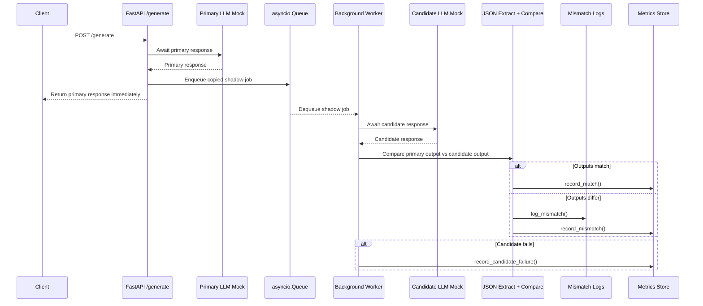

# Architecture Diagram

## Decoupling

The `/generate` endpoint awaits only the Primary LLM mock. After the Primary response is available, the endpoint copies the request payload, request ID, and Primary response into an `asyncio.Queue`.

The Candidate LLM is called later by a lifespan-managed background worker. Because the request handler does not await the Candidate call, Candidate latency or failure does not delay the client response.
